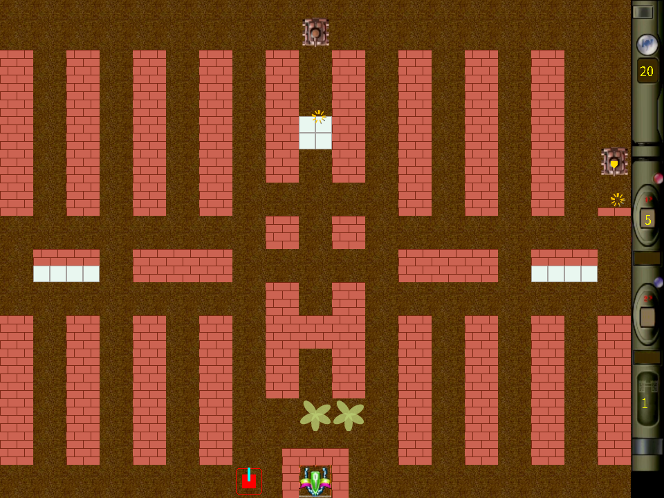
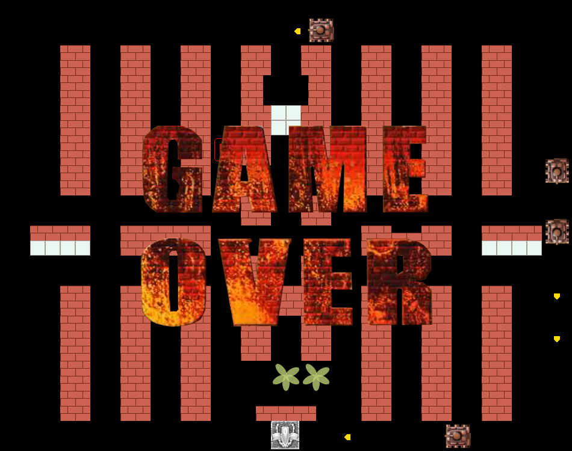

<h3 align="center">English | <a href="README.md">简体中文</a></h3>
# Preface
Use the Java language and the graphics, audio and other APIs provided by Java to imitate small games similar to the Xiaobawang plug-in game console or learning machine.

This project imitates a project on the Windows platform.
Tank Battle Deluxe Edition was downloaded from Huajun Software Park before. The developer is Mammoth Studio. The effect is quite good. It also supports handle operation and customizable buttons.

The colors of bricks and other tiles are taken from this game. They are hand-made using Java Swing Graphics API and audio API to try to restore the game effect. Due to the limited level, there is still a lot of room for improvement in the effect.
The map tiles are drawn using color picking software on the game, then measuring the pixel size and drawing them using code [haha].

Enemy tanks and some resource pictures were cut out using GIMP software (a software similar to PS). The audio resources are obtained from the Tank Battle Deluxe Edition installation directory.

# 1.original intention
* It can be regarded as a review and consolidation of learning Java Swing Graphics. Playing a small game can be regarded as not learning in vain, leaving some results as a souvenir of learning.
  I imitated Tank Battle on my childhood plug-in game console. It was a big challenge for me to imitate games like Contra and Super Mario. Tank Battle was a bit simpler.
  Start simple.

# Effect
* The following is the display effect of the first level, and the subsequent levels are to be implemented.
  
* old version  
  
* GAME OVER
  
* old version
  
* add home page
  

# run game
Download the latest version of the compressed package in release. After decompression, you will get a jar file WarOfTank.jar and a map folder. cd to the game directory in the terminal or command line cmd.
Then execute `java -jar WarOfTank.jar` to start the game. Of course, the premise is that the Java runtime environment has been installed on the computer. If it is not installed, you can install it first.
Windows, Linux, and Mac are all supported.

# problem
1. The size of the map tiles is very particular. I followed my own ideas and finally realized it. However, it did not meet the needs of the game and was very different from the original game. I changed it to smaller squares to meet the needs.
2. The complexity of the tank battle exceeded my expectations and imagination. On the other hand, I also wanted to make it as perfect as possible.
3. The collision processing between tanks and obstacles such as bricks in the map is quite complicated.
4. Tanks need to determine whether they have collided with each other, and need to handle the steering accordingly.
5. After the project becomes complex, there are also problems with code structure and organization.
6. and so on...

# Thanks
During the project development process, I sometimes encountered some problems. I thought about it for a long time and had no clue. I referred to the videos of two Bilibili bosses with the following titles:
* [牛B闪闪坦克大战开发记录（easyX版、已停更）【C\C++】](https://www.bilibili.com/video/BV1cE411o7Gj)
* [【C语言】项目实战：坦克大战丨C语言游戏开发教程](https://www.bilibili.com/video/BV1Ji4y117jk)

Especially the size of the tile map. I originally thought that the size of the tile map was too big. After reading what the boss did, I changed it to 1/2 of the original size to meet my needs.

When the NB Shining project author was playing Tank Battle in the simulator, he checked the memory and accidentally discovered the relevant data of the game map tiles, grass, bricks, steel, rivers, and snow.
Opened it in the emulator and verified that it is indeed the case. The author is very humorous. I admire it, there is still a lot to learn from the author.

# TODO
- [ ] 1.Maps of all subsequent levels
- [x] 2.Change the map tile size to an even number
- [ ] 3.Add enemy tanks that destroy steel
- [ ] 4.Add enemy tanks carrying props to realize the function of props
- [ ] 5.Add a map editor to realize self-built maps
- [ ] 6.Implement 2 player tanks
- [ ] 7.Customize buttons