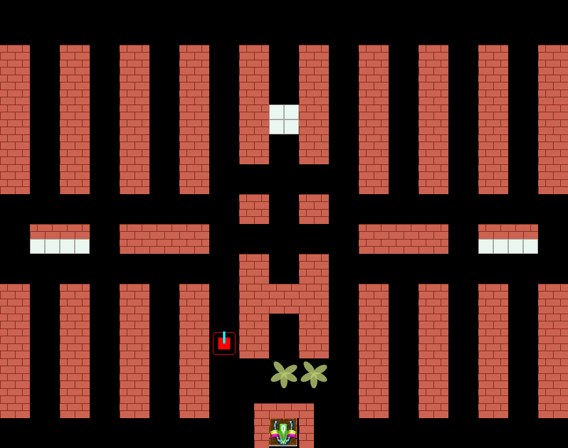
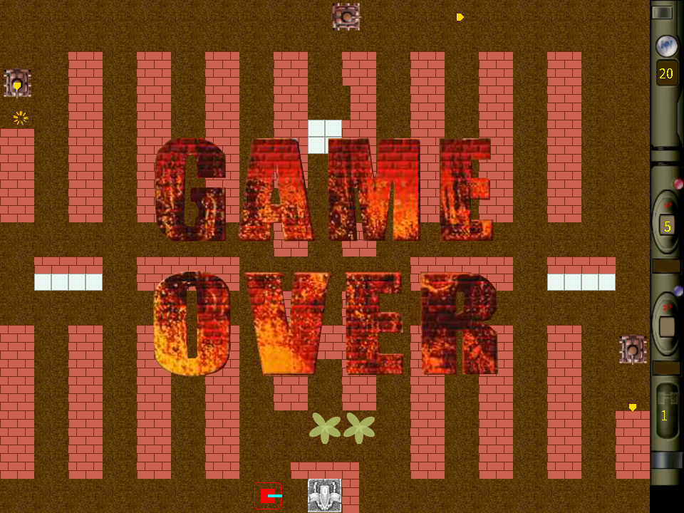
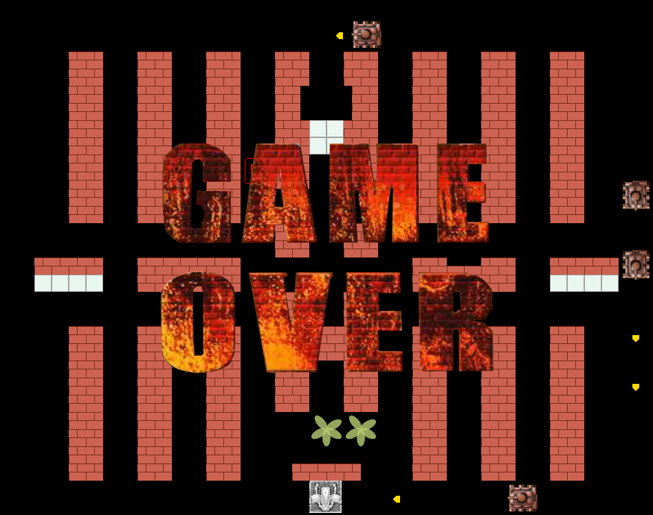
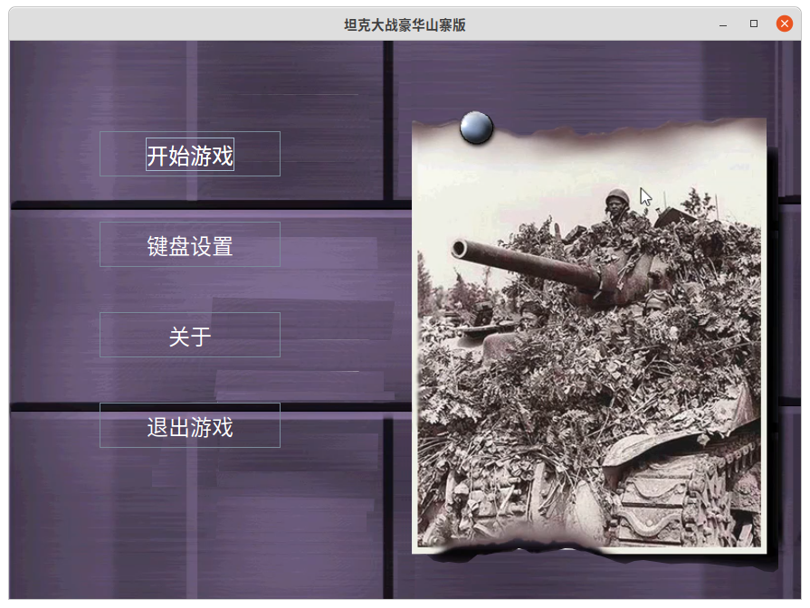

<h3 align="center">简体中文 | <a href="README-en.md">English</a></h3>
# 前言
使用Java语言和Java提供的图形、音频等API，模仿实现类似小霸王插卡游戏机或学习机的小游戏。

本项目模仿的是Windows平台的一个项目，
坦克大战豪华版，之前在华军软件园还是天空下载的，开发者是猛犸工作室，效果挺不错，还支持手柄操作，自定义按键。

砖头等瓦片的颜色取自这个游戏，用Java Swing Graphics API和音频API手搓出来的，尽量还原游戏效果，由于水平有限，效果还有很大提升空间。
地图瓦片是用取色软件在游戏上面取色，然后测量像素尺寸，用代码画出来的[哈哈]。

敌军坦克和一些资源图片是用GIMP软件(类似ps的软件)抠图制作出来的。 音频资源是从坦克大战豪华版安装目录获取的。

# 1.初衷
* 算是对java swing graphics学习的一个复习和巩固，做个小游戏也算没有白学一场，留下点成果作为学习过的纪念。
童年的插卡游戏机坦克大战模仿，魂斗罗、超级玛丽这样的游戏模仿起来对自己是一个很大的挑战，坦克大战还简单一些，
从简单的开始吧。

# 效果
* 下面是第一关的显示效果，后面的关卡待实现
  
* 旧版本效果old version  
  
* GAME OVER效果
  
* 旧版本效果old version
  
* 增加一个首页
  

# 运行游戏
在release中下载最新版的压缩包，解压后得到一个jar文件WarOfTank.jar和一个地图文件夹，在终端或命令行cmd中cd到游戏目录，
然后执行`java -jar WarOfTank.jar`即可开始游戏。当然前提是电脑中已经安装了Java运行时环境。没安装可以先安装一个。
Windows,Linux,Mac都支持。

# 问题
1. 地图瓦片的大小很有讲究，自己按自己的想法，最终实现了，但是与游戏需求对不大上，跟原游戏差距很大，更改为了更小尺寸的方格才满足需求。
2. 坦克大战的复杂程度超出了自己的预期和想象，另一方面也想尽量做的完善
3. 坦克与地图中的砖块等障碍物的碰撞处理挺复杂的。
4. 坦克之间需要判断是否撞车，需要转向等相应处理
5. 项目复杂起来之后，在代码结构和组织上也有问题
6. 还有一些

# 感谢
在项目开发过程中有时候遇到一些问题，思考良久，没有头绪，参考过2个B站大佬的视频，标题如下：
* [牛B闪闪坦克大战开发记录（easyX版、已停更）【C\C++】](https://www.bilibili.com/video/BV1cE411o7Gj)
* [【C语言】项目实战：坦克大战丨C语言游戏开发教程](https://www.bilibili.com/video/BV1Ji4y117jk)

尤其瓦片地图的尺寸，原来自己以为的瓦片地图尺寸还是太大了，看了大佬的做法，修改为原尺寸的1/2即可满足需求。

NB闪闪的项目作者在模拟器中玩坦克大战的时候，查看内存偶然发现了游戏地图瓦片的相关数据，草地、砖块、钢铁、河流、雪地，
用模拟器打开验证了一下，确实如此。作者很幽默。佩服，要向作者学习的地方还有很多。

# TODO未来任务
- [ ] 1.后续所有关卡的地图
- [x] 2.地图瓦片尺寸改为偶数
- [ ] 3.增加摧毁钢铁的敌军坦克
- [ ] 4.增加携带道具的敌军坦克，实现道具功能
- [ ] 5.增加地图编辑器，实现自建地图
- [ ] 6.实现2个玩家坦克
- [ ] 7.自定义按键